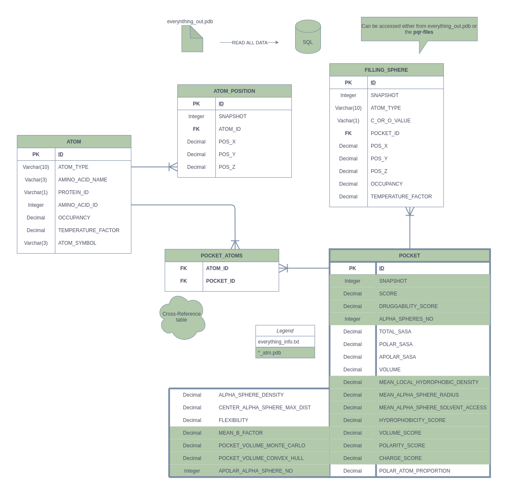
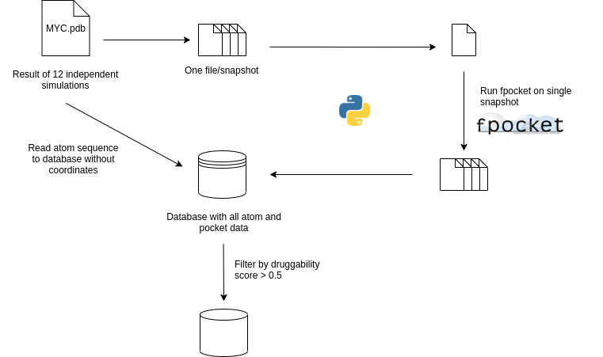
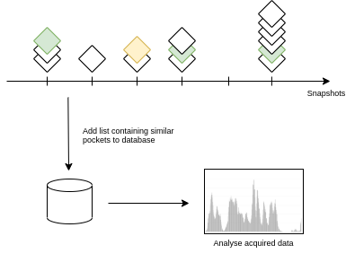
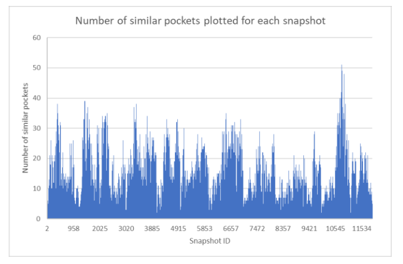
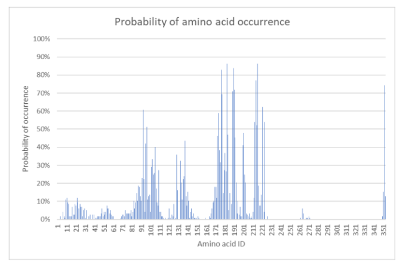
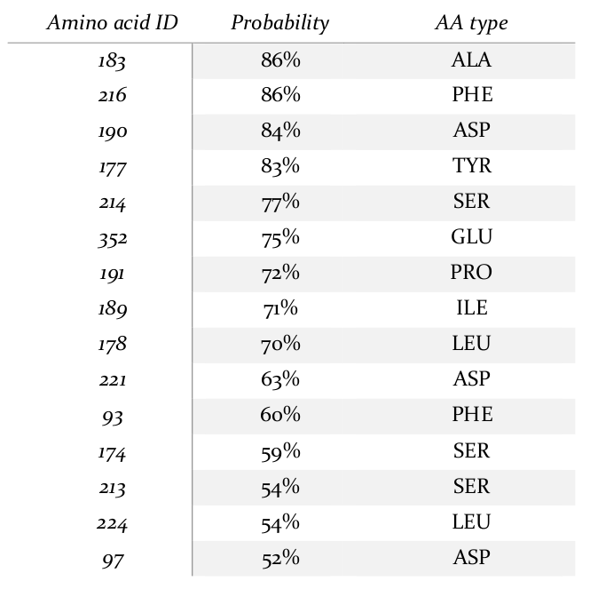
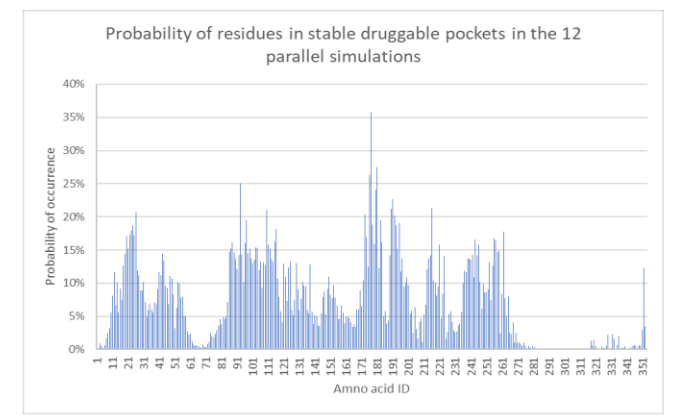

# Druggable pocket analyser

## Introduction

The Druggable Pocket Analyser was developed as part of a scientific project led by reserachers of Imperial College London, Department of Life Sciences. The project's goal was to identify potetially druggable segments of MYC protein which is one of the most important targets for the development of novel anti-cancer treatments.

This Python project helped in collecting, organising and analysing huge amount of data generated by simulations of the above-mentioned protein. From the gathered results an MSc dissertation was written.

## Scientific background

Cancer is amongst the leading causes for natural death worldwide. The master regulator of two third of
cancers, MYC has been heavily studied for decades but is still considered to be undruggable. This is mainly due to its intrinsically disordered nature, which means that a vast part of the protein has no secondary or tertiary structure. These parts were formerly viewed as passive parts of proteins connecting functional motifs. However, recent studies show that these intrinsically disordered proteins can also show some important functionalities.

This project aims to find druggable segments of MYC and utilizies several approaches to do so. One of these methods were to run a number of computational simulations and analyse the gathered results.

12 independent simulations were run and each resulted 1.000 snapshots taken of the momentary structure of the protein molecule. We used a third party tool, *fpocket* to investigate this structural information and generate some useful data by finding promising segments of the molecule from a pharmacologist point of view.

The generated data was structured and persisted in a relational database. We used several approaches to analyse the collected data and were able to identify the most promising parts of the molecule. The result colleted via this method correlated to the outcome of other approaches used in the scientific project.

## Applied technologies

- Python
    - this was an external technical requirement as researchers of the group had some experience in using Python
- Postgresql
- fpocket

## Data Reader (DR) module

This module is responsible for structuring raw data produced by the mentioned 12 simulations and collecting it into an SQL database.

The program first asks the user to enter a number of parameters. Hence, we are able to define at which snapshot to start the analysis, where to end it and decide if we would like to use a step higher than 1 when iterating over the snapshots.

Next the user enters the name of the input file which should be placed under the *resources/sample_data* directory. Of course it would be far more elegant to use an absolute path and not place the input file under the project folder but as the program is only used internally this was not considered to be a relevant aspect.

At first the DR module takes the huge (> 12GB) *.pdb* input file and cuts it into smaller files (1 file/snapshhot). These files can be parsed by *fpocket*. This tool is generally used to analyse a single snapshot taken of a molecule. Our approach, to use it to analyse the changing structure of the protein over a longer period of time is quite novel.

Fpocket takes a single snapshot's file as an input and generates a directory containing multiple files. These files are then parsed by DR module and the extracted data is collected into a relational database.

The database scheme can be seen in the image below:

The main logic of DR module can be observed in the following scheme:

The main concept of our project is **binding pocket**. This a concept widely used in protein research and defines a part of the molecule which is likely to be targeted by a small molecule API (active pharmaceutical ingredient).

However, as the protein has an ever-changing, intrinsically disordered structure, binding pockets found in the molecule are not necessarily stable over a longer period of time which is essential to increase the likelyhood of druggability.

Our next aim was to find and identify stable and druggable pockets in the molecule. However it is understandable that it is not easy to tell which pockets can be considered as the *same*.

Fpocket is able to find pockets but cannot compare them nor tell which pockets (found in differrent snapshots) are the same, as one same pocket can include slightly different amino acids (building blocks of portein chains) at different moments owing to the rapidly changing structure of the molecule.

This was the biggest challenge and the next step of our project: to identify frequent and druggable pockets found by *fpocket* by defining when to consider to pockets two be the *same*.

## Amino Acid Triplet (AAT) module

Our first approach was centered around a new concept: *amino acid triplet (AAT)*. An AAT consists of 3 amino acids included in the same binding pocket. We attempted to map each pocket with the list of every possible AATs defined by the amino acids included in the given pocket. In order to achieve this an SQL function was created followed by the creation of an SQL view which returned the most frequently appearing AATs in the database. The main idea was to identify these small chuncks, AATs which appear in many pockets and after the selection of best AATs reverse engineer and find pockets that include these AATs and further invetigate them.

This approach resulted in no success however, as there were no AAT peaks found. It was really hard to tell where to draw the line, above which AATs are considered to be frequently appearing. Besides that a vast amount of AATs had the same approximate occurance so we decided to discard using this approach.

## Amino Acid Array Processor (AAAP) module

Our next approach was to try and find for each pocket the most similar pocket of each snapshot in the narrow time interval around the original pocket's snapshot.

To reduce the runtime of this time-consuming process we filtered the identified pockets by their druggability score (> 0.5). This is a theoretical value calculated by *fpocket* itself which takes severaly pharmaceutical and structural factors into account.

AAAP module iterates over all these "good" pockets and defines the time interval environment investigated. This was defined as a +/- 100 ns environment of the snapshot in which the pocket was found limited by the start/end of the simulation to avoid comparing pockets found in different simulations.

For each snapshot in the time interval we select the best matching pocket compared to the selected one. If the similarity, defined by the ratio of common amino acids present in the two pockets, is higher than a pre-defined lower limit, we append the ID of this pocket to an accumulated list. We also save the snapshot to which this matching pocket belongs and persist these lists into new columns of the *pocket* table for the record of the selected pocket.

The main logic of AAAT module can be observed in the following scheme:

We defined a more and a less strict lower limit: 75% and 50% in similarity. As a result for each "good" pocket we obtained 4 lists containing the corresponding IDs:
- sibling_pockets_50
- sibling_pockets_75
- sibling_snapshots_50
- sibling_snapshots_75

With these lists at hand we analysed the exported results by plotting charts with Microsoft Excel. In the chart below we can see the number of similar pockets plotted against pocket ID. It is clearly visible that pockets around snapshots 10.600-10.800 show high similarity to each other. Pockets in this interval are also highly druggable with an average druggability score of 0.85.

We also plotted the occurance ratio of amino acids in pockets present in this interval and having at least 10 similars.

This table lists the highest occurring amino acids in the protein:

Finally, we also plotted the probability of occurrance of amino acids in all the 12.000 snapshots for pockets with at least 15 similars. The two charts show similar characteristics and the result correlates well with those obtained by other methods of the research.

## Conclusion

To summarize, we run *fpocket* programatically on the output file of 12 independent simulations. We structured and persisted the gathered data using an SQL database. Finally, we collected similar pockets and we were also able to identify the most promising segment of the protein molecule from a pharmaceutical point of view. Furthermore, this result corresponds well to other results gathered by the research group, so we can say that this approach can serve as a solid confirmation for experimental findings.

## Supporting materials

- Articles utilizing fpocket:
    - https://onlinelibrary.wiley.com/doi/full/10.1002/eji.201445307
    - https://academic.oup.com/nar/article/38/suppl_2/W582/1104984
    - https://bmcbioinformatics.biomedcentral.com/articles/10.1186/1471-2105-10-168